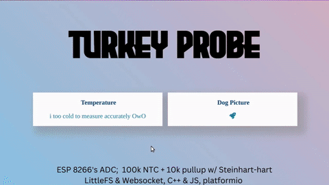
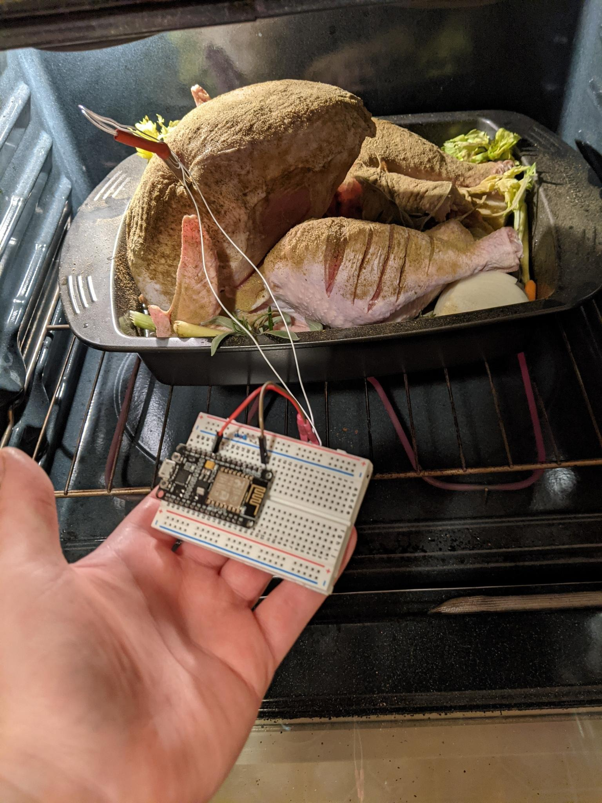
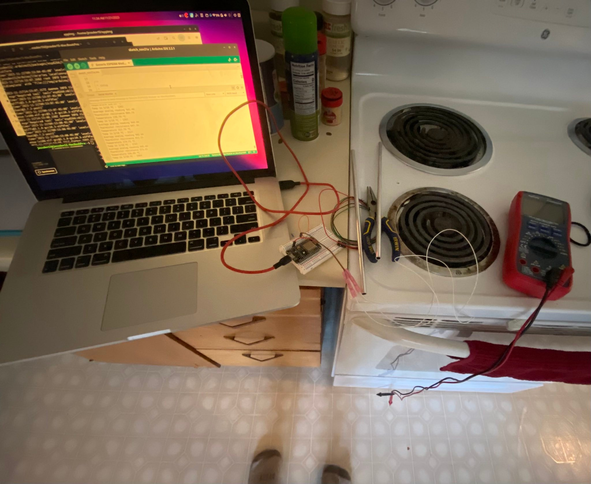

# Turkey Probe

A spur-of-the moment turkey thermometer with dubious accuracy, questionable code and unhelpful complexity made of random *gahbage*. 

Uses Steinhart-Hart equation to estimate the temperature from the 8266's analog pin (this board has a single channel 10 bit ADC) produced by a 100k 104GT-2/104NT-4 thermistor using 10k pullup resistor.  The ESP 8266 serves a real-time temperature readout via a websocket connection over the local network.  

<table>
  <thead>
    <tr>
      <th>
        
         <em> Turkey Probe in action *during* thanksgiving </em>
      </th>
        <th>
        
         <em> Moments *before* thanksgiving</em>
      </th>
    </tr>
  </thead>
</table>
